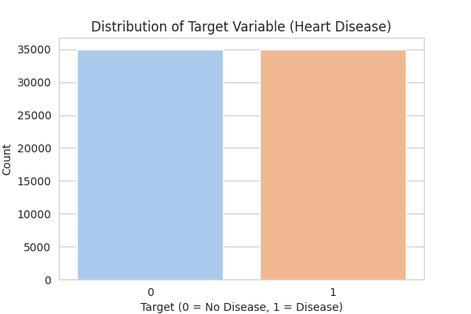
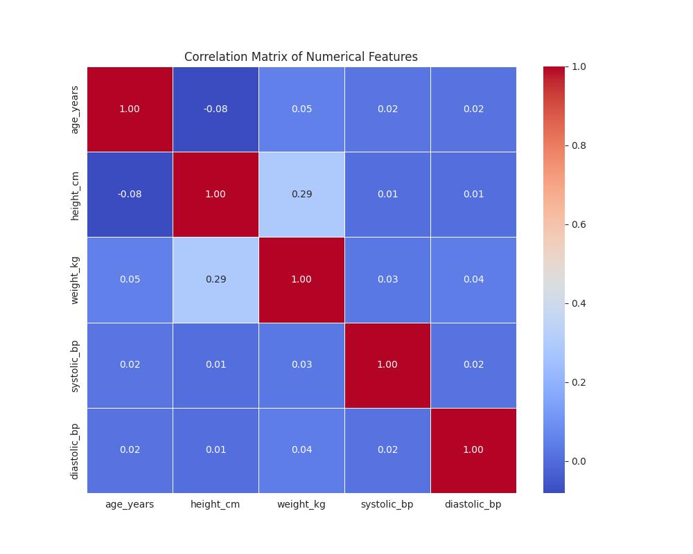

# MLOps Midterm Project: Cardiovascular Disease Prediction

This is the midterm project for the MLOps Zoomcamp. The objective is to build an end-to-end machine learning pipeline to predict the presence of cardiovascular disease (CVD) based on patient health metrics.

The project follows the best practices from the course and the "Deployment" workshop, including:

* **Dependency Management:** Using **uv** (a fast, modern alternative to pipenv)
* **Web Service:** Using **FastAPI** (instead of Flask) for its modern features
* **Containerization:** Using **Docker** for full reproducibility
* **Cloud Deployment:** Deployed to **Fly.io** for live testing

---

## 1. Problem Statement & Dataset

### Problem
The goal is to solve a **binary classification problem**: given a patient's health metrics, predict whether they have cardiovascular disease (target=1) or not (target=0).

### Dataset
* **Source:** [Kaggle: Cardiovascular Disease Dataset](https://www.kaggle.com/datasets/sulianova/cardiovascular-disease-dataset)
* **Content:** The dataset contains 70,000 patient records
* **Features Used:** `age_years`, `gender`, `height_cm`, `weight_kg`, `systolic_bp`, `diastolic_bp`, `cholesterol`, `glucose`, `is_smoker`, `is_alcoholic`, `is_active`

---

## 2. EDA & Model Training

All experimentation and analysis can be found in `notebooks/notebook.ipynb`.

* **Data Prep:** Column names were cleaned (e.g., `ap_hi` -> `systolic_bp`) and `age_days` was converted to `age_years` for better interpretability
* **Target Analysis:** The dataset is **perfectly balanced** (50.03% `target=0` and 49.97% `target=1`). This means **Accuracy** is a reliable metric for evaluation
* **Feature Importance:** Using Mutual Information and Correlation, the strongest predictors were found to be:
    1. `age_years` (Numerical)
    2. `weight_kg` (Numerical)
    3. `cholesterol` (Categorical)
* **Model Selection (Req: Train multiple models):**
    1. `LogisticRegression` (Baseline): **71.83% Accuracy**
    2. `RandomForestClassifier`: **70.31% Accuracy**
* **Final Model:** We selected `LogisticRegression` as our best model. The final model (`model.bin`) is a **`scikit-learn Pipeline`** that bundles the `StandardScaler` (for numerical data), the `DictVectorizer` (for categorical data), and the `LogisticRegression` model into a single object

* **Target Analysis:** The dataset is **perfectly balanced** (50.03% `target=0` and 49.97% `target=1`).



* **Feature Importance:** We analyzed the correlation of numerical features. `age_years` and `weight_kg` show the strongest correlation.



---

## 3. How to Run the Project (For Peer Review)

There are two methods to run this API. **Method 1 (Docker) is the recommended way.**

### Method 1: Run with Docker (Recommended)

This is the easiest and fastest way to run the service. It simulates a real-world production environment.

**Prerequisites:** You must have **Docker** installed.

1. **Clone the Repository:**
   ```bash
   git clone https://github.com/carlosaquinoperez/mlops-heart-disease-prediction.git
   cd mlops-heart-disease-prediction
   ```

2. **Build the Docker Image:**
   This command reads the `Dockerfile` and builds the container image.
   ```bash
   docker build -t heart-disease-api .
   ```

3. **Run the Docker Container:**
   This command starts the container and forwards port 9696.
   ```bash
   docker run -it --rm -p 9696:9696 heart-disease-api
   ```

4. **Done!** The API is now running and accessible at `http://localhost:9696`

### Method 2: Run Locally (with UV)

This method runs the app on your host machine using `uv`.

1. **Clone the Repository:**
   ```bash
   git clone https://github.com/carlosaquinoperez/mlops-heart-disease-prediction.git
   cd mlops-heart-disease-prediction
   ```

2. **Install `uv`:**
   ```bash
   pip install uv
   ```

3. **Install Dependencies:**
   `uv sync` reads the `uv.lock` file and installs the *exact* versions of all libraries into a `.venv`.
   ```bash
   uv sync --locked
   ```

4. **Run the API Server:**
   `uv run` executes the command inside the virtual environment.
   ```bash
   uv run uvicorn predict:app --host 0.0.0.0 --port 9696
   ```

5. **Done!** The API is now running and accessible at `http://localhost:9696`

---

## 4. API Endpoints & Usage

Once the API is running (using either method), you can interact with it.

### A: Interactive Docs (Easy Way)

The easiest way to test is to use the built-in FastAPI documentation (Swagger UI).

* **Go to:** `http://localhost:9696/docs`

From there, you can test the `/health` and `/predict` endpoints visually.

### B: `curl` (Command Line)

#### Health Check (GET)
Use this to check if the API is online.

```bash
curl http://localhost:9696/health
```

**Expected Response:**
```json
{"status":"ok"}
```

#### Prediction (POST)
This is the main endpoint. Send a POST request with the patient's data in JSON format.

**Example curl:**
```bash
curl -X 'POST' \
  'http://localhost:9696/predict' \
  -H 'accept: application/json' \
  -H 'Content-Type: application/json' \
  -d '{
  "age_years": 50,
  "gender": 2,
  "height_cm": 168,
  "weight_kg": 62.0,
  "systolic_bp": 110,
  "diastolic_bp": 80,
  "cholesterol": 1,
  "glucose": 1,
  "is_smoker": 0,
  "is_alcoholic": 0,
  "is_active": 1
}'
```

**Expected Response:**
```json
{
  "has_cardiovascular_disease": false,
  "probability": 0.123456789
}
```

---

## 5. (Bonus) Cloud Deployment

For the bonus points, this containerized application has been deployed to the cloud using Fly.io.

You can test the LIVE API endpoints here:

* **Live Docs UI:** https://mlops-heart-disease-prediction.fly.dev/docs
* **Live Health Endpoint:** https://mlops-heart-disease-prediction.fly.dev/health

---

## 6. Limitations & Next Steps

* **Model Tuning:** The RandomForest model performed worse than the baseline, likely due to a lack of hyperparameter tuning
* **Feature Engineering:** More complex features, like Body Mass Index (BMI) from `height_cm` and `weight_kg`, could improve performance.
* **CI/CD:** The `fly.toml` file is configured, but a full GitHub Actions workflow for continuous deployment has not been set up